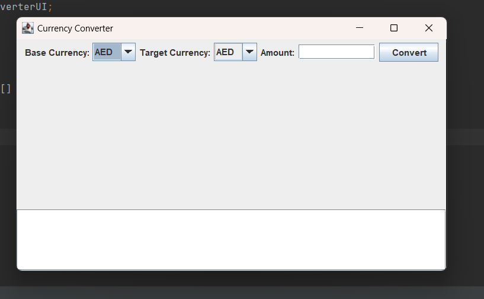
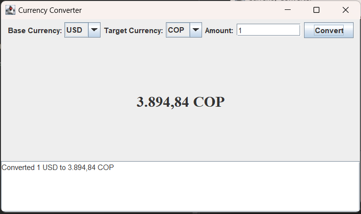

# Conversor de Divisas - Alura Java Challenge

Este proyecto de conversor de divisas permite a los usuarios convertir montos entre diferentes monedas utilizando las tasas de cambio actuales obtenidas de la API ExchangeRate-API. Las tasas de cambio se guardan localmente para mejorar la eficiencia y reducir el número de llamadas a la API.

## Estructura del Proyecto

El proyecto está dividido en dos paquetes principales:

- `com.currency.api`: Contiene la lógica para interactuar con la API externa y manejar los datos de tasas de cambio.
- `com.currency.iu`: Contiene la interfaz de usuario, permitiendo a los usuarios realizar conversiones de monedas de forma interactiva.

## Componentes Clave

### `CurrencyExchangeAPI`

- **Ubicación**: `com.currency.api`
- **Funcionalidades**:
    - **`getExchangeRates(String baseCurrency)`**: Obtiene las tasas de cambio para una moneda base dada desde la API y las guarda en un archivo local.
    - **`readRatesFromFile()`**: Lee las tasas de cambio desde un archivo local. Si el archivo no existe, realiza una llamada a la API para obtener las tasas y las guarda.
    - **`getAvailableCurrencies()`**: Devuelve un conjunto de monedas disponibles basado en las últimas tasas de cambio guardadas.
    - **`convertCurrency(String sourceCurrency, String targetCurrency, double amount)`**: Convierte un monto dado de una moneda origen a una moneda destino utilizando las tasas de cambio guardadas.

### `CurrencyConverterUI`

- **Ubicación**: `com.currency.iu`
- **Funcionalidades**:
    - Interfaz gráfica que incluye:
        - Dos `JComboBox` para seleccionar las monedas de origen y destino.
        - Un campo de texto para ingresar el monto a convertir.
        - Un botón para realizar la conversión.
        - Un `JLabel` para mostrar el resultado de la conversión de manera prominente.
        - Un `JTextArea` para mostrar detalles adicionales o errores.

## Cómo Funciona

1. **Inicialización**:
    - Al iniciar la aplicación, se carga la interfaz de usuario y se inicializan los `JComboBox` con las monedas disponibles utilizando las tasas de cambio leídas desde el archivo local.

2. **Conversión de Divisas**:
    - El usuario selecciona las monedas de origen y destino, ingresa un monto y presiona el botón "Convertir".
    - La aplicación calcula el monto convertido utilizando el método `convertCurrency` de la clase `CurrencyExchangeAPI`.
    - El resultado se muestra en la interfaz de usuario.

3. **Manejo de Errores**:
    - Si ocurre un error durante la conversión (por ejemplo, falta de tasas de cambio para las monedas seleccionadas), se muestra un mensaje de error en la interfaz de usuario.

## Requisitos

- Java 8 o superior.
- Gson library para el manejo de JSON.
- Acceso a Internet para realizar llamadas iniciales a la API (si no hay datos locales disponibles).

## Screenschot

